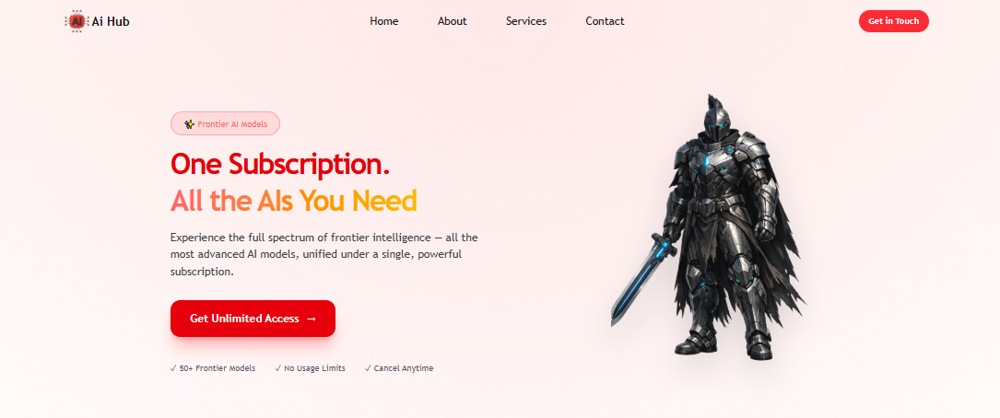
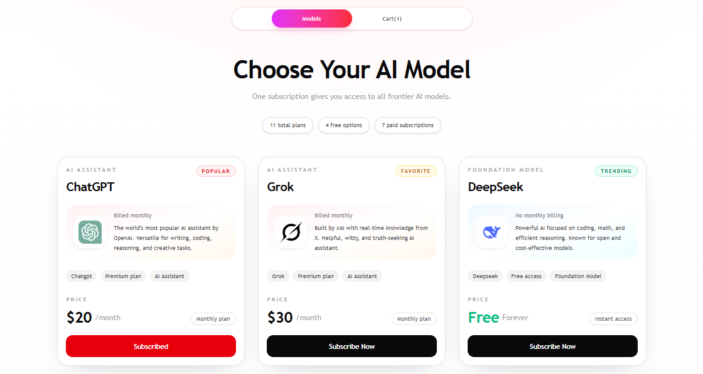

<div align="center">

# AI Hub

### One Subscription. All the AIs You Need.

A polished AI subscription showcase built with React and Vite where users can explore frontier AI models, subscribe to plans, manage a cart, remove items, and complete a simulated checkout flow with instant toast feedback.

[](https://aihub-box.vercel.app/)
[](https://react.dev/)
[](https://vitejs.dev/)
[](https://tailwindcss.com/)
[](https://daisyui.com/)
[](https://fkhadra.github.io/react-toastify/introduction)
[](https://aihub-box.vercel.app/)

</div>

---

## Preview

<p align="center">
  
</p>

<p align="center">
  
</p>

> **Live Site:** [https://aihub-box.vercel.app/](https://aihub-box.vercel.app/)

---

## Features

| Feature                   | Description                                                                                                   |
| :------------------------ | :------------------------------------------------------------------------------------------------------------ |
| Hero Landing Experience   | Presents a bold subscription banner with a strong CTA and branded AI-focused visual style                     |
| Model Showcase Grid       | Displays AI plans from a local JSON source with pricing, category labels, status badges, and logos            |
| Models and Cart Tabs      | Lets users switch between browsing plans and reviewing selected paid subscriptions                            |
| Subscribe Flow            | Free models can be subscribed instantly, while paid models are added to the cart through the same action flow |
| Cart Management           | Users can review cart items, remove individual subscriptions, and monitor the total monthly cost              |
| Checkout Interaction      | The checkout button clears the cart and simulates a successful payment flow                                   |
| Toast Notifications       | React Toastify provides success and error feedback for add, duplicate add, delete, and checkout actions       |
| Local Storage Persistence | Cart and subscription state persist in the browser across refreshes                                           |
| Responsive UI             | The landing page, model cards, and cart layout adapt across desktop and mobile screen sizes                   |

---

## Tech Stack

<div align="center">

|     Technology      |                         Purpose                         |
| :-----------------: | :-----------------------------------------------------: |
|    **React 19**     |        Component-driven UI and state management         |
|     **Vite 8**      |     Fast development server and production bundling     |
| **Tailwind CSS 4**  |   Utility-first styling and responsive layout control   |
|    **DaisyUI 5**    | UI primitives such as navbar, buttons, and menu styling |
| **React Toastify**  |    Notification system for cart and checkout actions    |
| **Local JSON Data** |        Model data served from `public/Data.json`        |
|     **Vercel**      |                 Deployment and hosting                  |

</div>

---

## Getting Started

### Prerequisites

- **Node.js** `v18+`
- **npm** `v9+`

### Installation

1. **Clone the repository**

   ```bash
   git clone <your-repository-url>
   cd AI-Hub
   ```

2. **Install dependencies**

   ```bash
   npm install
   ```

3. **Start the development server**

   ```bash
   npm run dev
   ```

4. **Open in your browser**

   Navigate to `http://localhost:5173` to view the app locally.

### Build for Production

```bash
npm run build
```

The optimized output will be generated in the `dist/` directory.

### Lint the Project

```bash
npm run lint
```

---

## Project Structure

```text
AI-Hub/
|-- public/
|   |-- assets/
|   |   |-- banner.png
|   |   |-- logo.png
|   |   `-- logos/
|   |       |-- ChatGPT_logo.svg.png
|   |       |-- claude-ai-icon.webp
|   |       |-- copilot-logo.png
|   |       |-- Deepseek-logo-icon.svg.png
|   |       |-- gemini-logo.png
|   |       |-- grok-seeklogo-.svg
|   |       |-- kimi-logo.png
|   |       |-- meta-ai-logo.png
|   |       |-- mistral-logo.png
|   |       |-- perplexity-ai-icon.webp
|   |       `-- qwen-logo.jpg
|   |-- Data.json
|   |-- favicon.svg
|   |-- icons.svg
|   |-- preview1.png
|   `-- preview2.png
|-- src/
|   |-- assets/
|   |   |-- hero.png
|   |   |-- react.svg
|   |   `-- vite.svg
|   |-- Components/
|   |   `-- Pages/
|   |       `-- HomePage/
|   |           |-- Cards.jsx
|   |           |-- ChooseAiModel.jsx
|   |           |-- Footer.jsx
|   |           |-- Hero.jsx
|   |           `-- Nav.jsx
|   |-- App.jsx
|   |-- index.css
|   `-- main.jsx
|-- index.html
|-- package.json
|-- README.md
`-- vite.config.js
```

---

## Design Highlights

- Bold hero section with a large headline, glowing CTA styling, and a strong AI-product landing page feel
- Clean card-based plan browsing with badges, pricing hierarchy, and branded model logos
- Tabbed models and cart flow that keeps browsing and checkout states organized
- Persistent local experience using `localStorage` for cart and subscription actions
- Fast feedback loop through toast notifications for key user interactions

---

## Data Source

This project uses a local dataset stored in:

```text
public/Data.json
```

Each model entry includes:

- Id
- Slug
- Title
- Description
- Price
- Free or paid status
- Category
- Logo image path
- Status label

---

## Deployment

The application is deployed on **Vercel**:

**Live URL:** [https://aihub-box.vercel.app/](https://aihub-box.vercel.app/)

---

<div align="center">

**If you found this project useful, consider giving it a star.**

Made with React, Vite, Tailwind CSS, DaisyUI, and React Toastify

</div>
